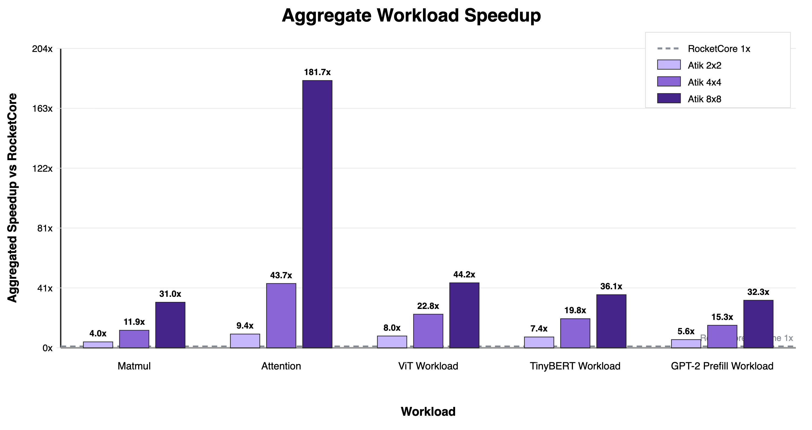
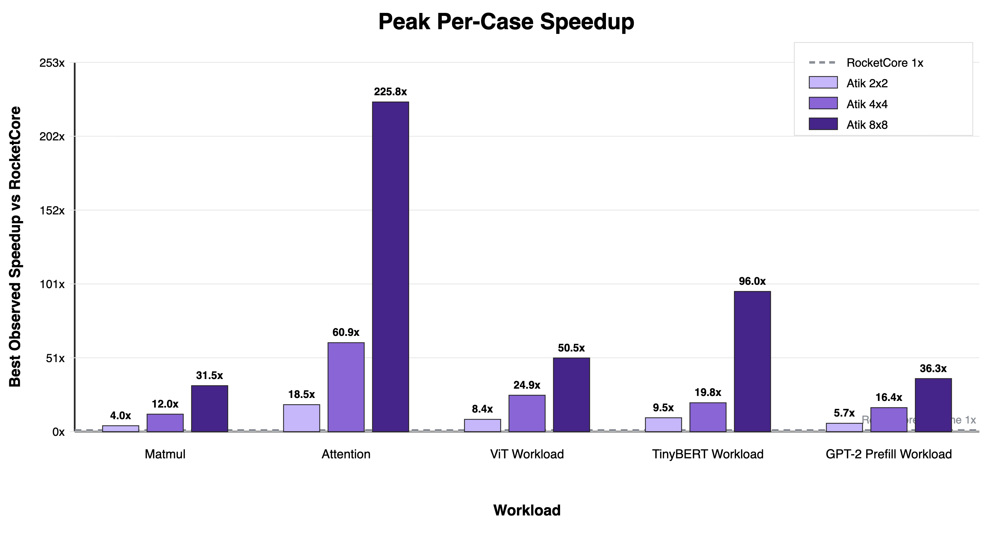
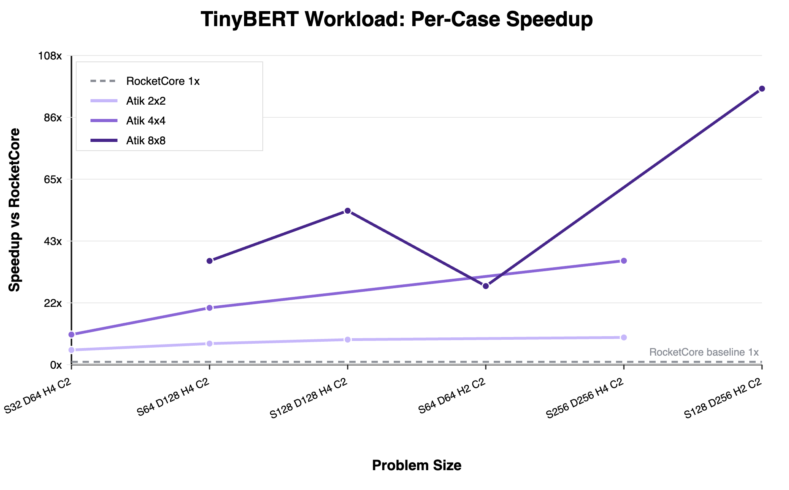
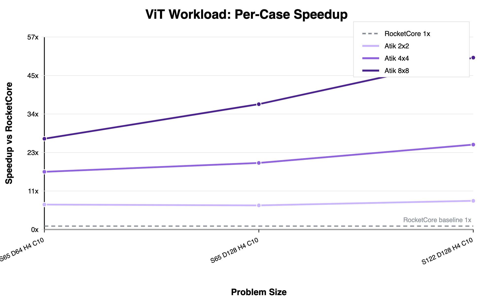
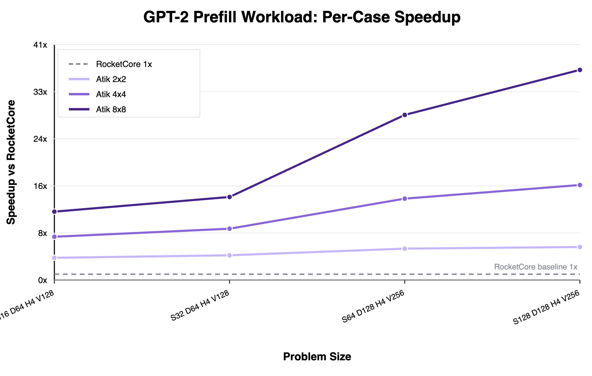
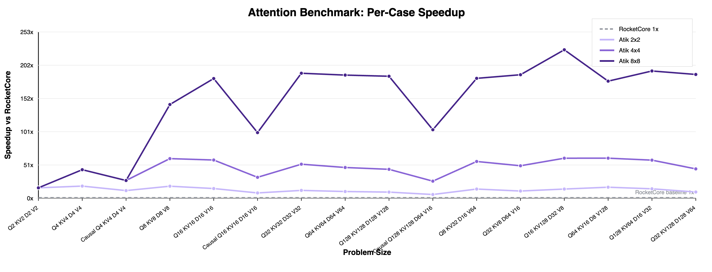
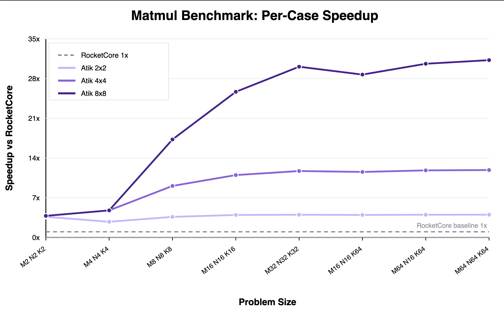

## TL;DR
**Atik** is an open-source AI Accelerator Hardware.

*What makes it so special?* Here 👇

✅ **Attention** mechanism smelted directly into silicon  
✅ Prototyped end-to-end on **FPGA** (AWS F2)  
✅ Benchmarked against **PyTorch**-based workloads  
✅ Built on the **RocketChip** architecture (RISC-V)  
✅ Native **BF16** support  
✅ Up to **100×** speedup on vanilla attention  
✅ Up to **80×** speedup on TinyBERT  
✅ Up to **30×** speedup on GPT-2 prefill  

- Don't believe benchmark results? Click to watch the [playlist](https://www.youtube.com/playlist?list=PL6v0daaIvQGvxYVnezbRdfBysHe-s8BjE).
- Want to simulate it locally? Check out this video. *(Coming soon)*

*From here upon nerdy people can continue reading :)*


## Why Atik ?
There's definitely a growing interest in academia around Attention accelerators, rivaling the interest in systolic hardware. But honestly, a lot of the current research feels a bit too theoretical. Some of it relies purely on C++ simulators like gem5, lacking time-accurate simulation or a proper VLSI flow. Otherwise, it tends to be closed-source, or a standalone ASIC implementation that doesn't really integrate with standard CPU workloads. 

The mature, open-source DNN accelerators we already have—like NVDLA and Gemmini—are starting to feel a bit legacy. They were beautifully built for the needs of their time, optimizing for CNNs and vision tasks, but they don't support Attention mechanisms. Plus, they focus on quantized datatypes like INT8, which just isn't ideal for modern day-to-day applications that rely so heavily on BF16. 

Standard vector units simply aren't cutting it anymore. With transformers being adopted everywhere, we really need systolic arrays working right alongside Softmax modules to finally tackle those heavy attention workloads. 

To bring it all together: what the open-source hardware community truly needs right now is a dedicated Attention and MatMul accelerator. It needs to support BF16 natively, sit on top of a robust computer architecture like RocketChip, be easily benchmarked against modern PyTorch workloads, and be fully ready for FPGA prototyping.

This is the gap **Atik** is trying to fill. A modern opensource Tightly-Coupled AI accelerator. FPGA-prototypable. VLSI-verified. Preparing for someone to tape it out! 


## How Speedup Is Calculated

For the standalone matmul and attention benchmarks, speedup is measured by running the same kernel twice: once with the software BF16 reference implementation and once with Atik. Both paths are timed with the RISC-V cycle counter, and the hardware result is also checked against the software output.

```c
const uint64_t cpu_start = atik_bench_read_cycles();
atik_ref_matmul_bf16(...);
const uint64_t cpu_cycles = atik_bench_read_cycles() - cpu_start;

atik_clear_counters();
atik_matmul_bf16(...);
const uint64_t hw_cycles = atik_read_counter(ATIK_COUNTER_TOTAL_CYCLES);
```

For the PyTorch-derived workloads, running the full model twice would be unnecessarily expensive. Instead, the benchmark profiles the full CPU workload, separately profiles the parts replaced by Atik, and estimates the accelerated workload as:

```text
accelerated_cycles = cpu_total_cycles - cpu_replaced_cycles + hw_replacement_cycles
```

This keeps the comparison cycle-based while avoiding repeated full-model replays. The implementation lives in [`software/src/pytorch_workload.c`](software/src/pytorch_workload.c), especially the `hybrid_cycles` accounting path.

## Architecture

Atik is a RoCC-attached accelerator. Software describes an operation with an `atik_desc_t`, sends the descriptor address with `set_desc`, and starts execution with `run`. Hardware fetches that descriptor, decodes whether the operation is matmul, attention, or causal attention, and dispatches to the matching controller.

Both matmul and attention use explicit DMA, local SRAM-backed tile buffers, BF16-to-fixed conversion, a shared fixed-point MAC mesh, and BF16 writeback. Matmul uses the mesh for `C += A * B`; attention reuses the same mesh for both QK score computation and probability-times-V accumulation, with scalar-scheduled softmax, reciprocal, and normalization around it.

The deeper design notes are kept in [`manifest/architecture.md`](manifest/architecture.md). The end-to-end operation flows are documented in [`manifest/scenarios/matmul.md`](manifest/scenarios/matmul.md) and [`manifest/scenarios/attention.md`](manifest/scenarios/attention.md).

## Time & Cycle Accurate Simulation On FPGA

Atik is integrated with FireSim for cycle-accurate FPGA simulation on AWS F2. The FireSim configuration files under [`firesim/`](firesim/) describe the build recipes, hardware database entries, and deployment setup for the 2x2, 4x4, and 8x8 RoCC configurations.

Prebuilt AGFI entries are listed in [`firesim/config_hwdb.yaml`](firesim/config_hwdb.yaml). Fresh images can be rebuilt from the recipes in [`firesim/config_build_recipes.yaml`](firesim/config_build_recipes.yaml) and selected through [`firesim/config_build.yaml`](firesim/config_build.yaml). In practice, this means the same Chisel design can be taken from source to a FireSim image and benchmarked with the software workloads in this repository.

## Benchmark Results



These plots summarize the same benchmark suite across the 2x2, 4x4, and 8x8 Atik configurations. The workloads are intentionally different: matmul stresses dense BF16 matrix multiplication, attention stresses the QK, softmax, and PV path, while ViT, TinyBERT, and GPT-2 prefill exercise PyTorch-derived transformer layers with different sequence lengths, embedding widths, and head counts. Problem size has a direct effect on the speedup ratio, since larger cases usually amortize descriptor handling, DMA setup, and controller overhead more effectively. The benchmark set therefore includes a range of small and large cases, especially in the PyTorch-derived workloads, so the results show both overhead-dominated and compute-dominated behavior.

The aggregate plot sums all RocketCore cycles and all Atik cycles for the matching problem sizes in each workload, then reports `sum(cpu_cycles) / sum(hw_cycles)`. This is the more conservative view because every included case contributes to the final number. In this view, the 8x8 design reaches about 31x on matmul, 182x on attention, 44x on ViT, 36x on TinyBERT, and 32x on GPT-2 prefill.

The peak plot shows the best single observed case for each workload and hardware size. This highlights where the accelerator is most effectively amortizing control, DMA, and setup overheads over larger compute tiles. Peak speedup reaches 225.8x on attention with the 8x8 design, 96.0x on TinyBERT, 50.5x on ViT, 36.3x on GPT-2 prefill, and 31.5x on standalone matmul.

### PyTorch Workloads
The PyTorch-style workloads are ported into small C reference models that preserve the same kernel structure used by the corresponding model stage. The benchmark compares three paths: the original ground-truth output, the C reference output, and the Atik output. Reporting both CPU and hardware error makes sure the C workload itself matches the intended model behavior before judging the accelerator result.

Multi-head attention is handled by decomposing the model into per-head QK, softmax, and PV operations. Atik accelerates those repeated attention kernels while the software harness keeps the surrounding model bookkeeping, tensor layout, and workload-level accounting consistent across configurations.

#### TinyBERT

TinyBERT keeps the transformer structure but uses a smaller configuration than full BERT: fewer layers, smaller hidden dimensions, fewer heads, and a compact classifier head. In these benchmarks, sequence length, model width, head count, hidden size, and class count are the main parameters being varied.

In the figure labels, `S` is sequence length, `D` is model dimension, `H` is the number of attention heads, and `C` is the number of output classes. Increasing `S` grows the attention matrices, increasing `D` grows the projection and matmul work, increasing `H` adds more per-head attention instances, and increasing `C` expands the final classifier projection.

The TinyBERT results show the expected size sensitivity. Small cases are more affected by fixed launch, DMA, and control overhead, while larger cases give the 4x4 and 8x8 designs more useful work per descriptor. The 8x8 configuration scales best on the larger TinyBERT cases and reaches the highest observed TinyBERT peak.

#### Vision Transformer

The ViT workloads vary image-derived sequence length, patch dimension, model width, head count, MLP hidden size, and class count. This makes ViT a useful benchmark for checking how the accelerator behaves when attention and projection sizes grow together.

For ViT, `S` is the token sequence length after patching, `D` is the model dimension, `H` is the number of attention heads, and `C` is the number of output classes. Larger `S` increases the QK and attention score sizes, larger `D` increases projection and value accumulation work, larger `H` increases the number of attention heads to schedule, and larger `C` increases the final classification layer.

As with TinyBERT, larger ViT cases give the wider configurations more opportunity to amortize overhead. The 8x8 design consistently benefits from the larger problem sizes, while the smaller designs still improve over RocketCore but saturate earlier.

#### GPT-2 Prefill Stage

GPT-2 prefill stresses the transformer path before autoregressive token-by-token decoding. The benchmark varies sequence length, model width, head count, hidden size, and vocabulary projection size, so it captures the cost of filling the initial context window.

In the GPT-2 prefill labels, `S` is sequence length, `D` is model dimension, `H` is the number of attention heads, and `V` is vocabulary size for the output projection. Increasing `S` grows the context window and attention work, increasing `D` grows the transformer projections, increasing `H` adds more per-head attention work, and increasing `V` expands the logits projection.

The same scaling pattern appears here: larger sequence and model sizes improve accelerator utilization, and the 8x8 configuration produces the strongest speedups. The gap between configurations is clearest on the larger prefill cases, where the wider mesh has enough work to stay busy.


### C Workloads


The standalone C workloads isolate the kernels more directly than the PyTorch-derived tests. Both matmul and attention show clear scaling from 2x2 to 4x4 to 8x8, especially as the problem size becomes large enough to hide fixed overheads.

For attention, `Q` is the number of query tokens, `KV` is the number of key/value tokens, `D` is the key/query head dimension, and `V` is the value dimension. The QK score computation scales with `Q * KV * D`, while the PV accumulation scales with `Q * KV * V`, so increasing any of these dimensions raises the amount of accelerator work.

The scaling is not unbounded. Once the mesh is well utilized, performance starts to plateau because DMA traffic, local buffering, controller scheduling, and scalar softmax work become more visible. Causal attention is also harder to accelerate than non-causal attention because masking removes useful work from part of the score matrix while the control flow still has to preserve the causal dependency structure.

For matmul, `M`, `N`, and `K` describe the multiplication `C[M, N] = A[M, K] * B[K, N]`. Increasing `M` or `N` grows the output tile count, while increasing `K` grows the reduction work per output element. The total arithmetic work scales as `M * N * K`.

## Benchmark Videos

## VLSI Flow


Atik also includes a Hammer/OpenROAD flow for standalone `AtikCore` synthesis experiments. The current scripts target the accelerator core rather than a full RocketTile or ChipTop, which keeps the flow focused on the accelerator datapath, controllers, DMA logic, and local buffering. The launch scripts and Sky130/OpenROAD configuration live under [`vlsi/hammer/`](vlsi/hammer/), and the latest synthesis summary is kept in [`vlsi/syn.rpt`](vlsi/syn.rpt).

| Metric | 2x2 normal | 4x4 normal | 8x8 normal |
|---|---:|---:|---:|
| Config | `Atik2x2RoCCConfig` | `Atik4x4RoCCConfig` | `Atik8x8RoCCConfig` |
| Mesh size | 2x2 | 4x4 | 8x8 |
| MAC lanes | 4 | 16 | 64 |
| Top synthesized cells | 114,575 | 190,722 | 477,464 |
| Top synthesized area | 721,211.7 | 1,217,183.6 | 3,130,859.0 |
| Area per MAC lane | 180,302.9 | 76,074.0 | 48,919.7 |

The area scales with mesh size, but the area per MAC lane improves as the fixed control and DMA overheads are amortized across more lanes. This is the expected behavior for a design where the descriptor path, counters, scalar softmax units, and tile DMA logic are shared around a larger mesh.

| Module | 2x2 area | 4x4 area | 8x8 area |
|---|---:|---:|---:|
| `AttentionController` | 192,507.1 | 232,010.0 | 369,431.8 |
| `MatmulController` | 127,462.2 | 133,305.4 | 154,623.3 |
| `AttentionScalarMul` | 99,010.0 | 99,010.0 | 99,010.0 |
| `TileDmaReader` | 81,989.9 | 81,942.3 | 81,908.6 |
| `TileDmaWriter` | 5,700.5 | 9,265.1 | 17,186.5 |

The largest blocks are the attention and matmul controllers, followed by the shared scalar multiply path and tile DMA reader. Some blocks, such as `AttentionScalarMul` and `TileDmaReader`, stay nearly constant across mesh sizes because they are shared infrastructure rather than per-lane compute.

## Project Timeline

Atik is the current version of the project. It is a modular, synthesizable, RoCC-attached AI accelerator with BF16 matmul and online attention support, explicit DMA, SRAM-backed tile buffers, shared mesh compute, FireSim integration, and a standalone VLSI flow.

The previous major branch is `girdap`. That version explored a larger accelerator structure with separate attention and matmul paths. It helped validate the direction, but the design was harder to synthesize, less modular, and carried more integration complexity than the current shared-mesh Atik architecture.

Before that, the `toyrocc` branch contained early RoCC experiments and prototype softmax/attention modules. Those pieces were useful for learning the control and numerical problems, but they were not organized as the current reusable, module-level accelerator design.

## Acknowledgment

Atik builds on the open-source RISC-V hardware ecosystem. Special thanks to UC Berkeley and the broader Chipyard community for Rocket Chip, RoCC integration patterns, and FireSim infrastructure. The project also depends on the Chisel/CHIPS Alliance toolchain, Hammer/OpenROAD VLSI flows, and the Sky130 open PDK ecosystem for the hardware generation and implementation path.

Historical versions of this work live in the `toyrocc` and `girdap` branches. Those experiments shaped the current Atik architecture, especially the move toward a cleaner shared-mesh accelerator with explicit DMA, SRAM-backed tiles, and a smaller software ABI.

## Citation

If you use Atik in academic work, please cite the repository:

```bibtex
@misc{atik,
  author = {Ahmed Zeer},
  title = {Atik: RoCC Based Transformer Accelerator},
  year = {2026},
  url = {https://github.com/AhmedZeer/atik}
}
```
